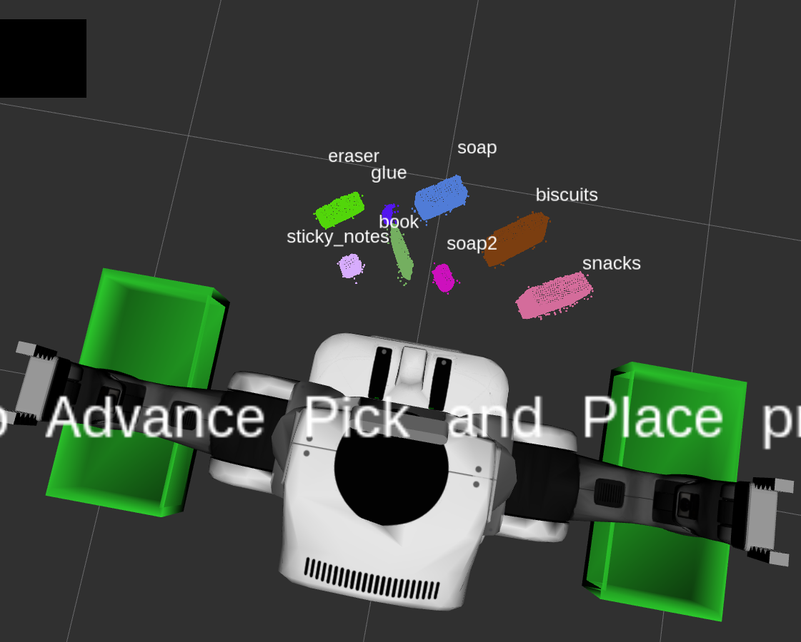

## Project: Perception Pick & Place
### Writeup Template: You can use this file as a template for your writeup if you want to submit it as a markdown file, but feel free to use some other method and submit a pdf if you prefer.

---

# Required Steps for a Passing Submission:
1. Extract features and train an SVM model on new objects (see `pick_list_*.yaml` in `/pr2_robot/config/` for the list of models you'll be trying to identify). 
2. Write a ROS node and subscribe to `/pr2/world/points` topic. This topic contains noisy point cloud data that you must work with.
3. Use filtering and RANSAC plane fitting to isolate the objects of interest from the rest of the scene.
4. Apply Euclidean clustering to create separate clusters for individual items.
5. Perform object recognition on these objects and assign them labels (markers in RViz).
6. Calculate the centroid (average in x, y and z) of the set of points belonging to that each object.
7. Create ROS messages containing the details of each object (name, pick_pose, etc.) and write these messages out to `.yaml` files, one for each of the 3 scenarios (`test1-3.world` in `/pr2_robot/worlds/`).  [See the example `output.yaml` for details on what the output should look like.](https://github.com/udacity/RoboND-Perception-Project/blob/master/pr2_robot/config/output.yaml)  
8. Submit a link to your GitHub repo for the project or the Python code for your perception pipeline and your output `.yaml` files (3 `.yaml` files, one for each test world).  You must have correctly identified 100% of objects from `pick_list_1.yaml` for `test1.world`, 80% of items from `pick_list_2.yaml` for `test2.world` and 75% of items from `pick_list_3.yaml` in `test3.world`.
9. Congratulations!  Your Done!

# Extra Challenges: Complete the Pick & Place
7. To create a collision map, publish a point cloud to the `/pr2/3d_map/points` topic and make sure you change the `point_cloud_topic` to `/pr2/3d_map/points` in `sensors.yaml` in the `/pr2_robot/config/` directory. This topic is read by Moveit!, which uses this point cloud input to generate a collision map, allowing the robot to plan its trajectory.  Keep in mind that later when you go to pick up an object, you must first remove it from this point cloud so it is removed from the collision map!
8. Rotate the robot to generate collision map of table sides. This can be accomplished by publishing joint angle value(in radians) to `/pr2/world_joint_controller/command`
9. Rotate the robot back to its original state.
10. Create a ROS Client for the “pick_place_routine” rosservice.  In the required steps above, you already created the messages you need to use this service. Checkout the [PickPlace.srv](https://github.com/udacity/RoboND-Perception-Project/tree/master/pr2_robot/srv) file to find out what arguments you must pass to this service.
11. If everything was done correctly, when you pass the appropriate messages to the `pick_place_routine` service, the selected arm will perform pick and place operation and display trajectory in the RViz window
12. Place all the objects from your pick list in their respective dropoff box and you have completed the challenge!
13. Looking for a bigger challenge?  Load up the `challenge.world` scenario and see if you can get your perception pipeline working there!

## [Rubric](https://review.udacity.com/#!/rubrics/1067/view) Points
### Here I will consider the rubric points individually and describe how I addressed each point in my implementation.  

---
### Writeup / README

#### 1. Provide a Writeup / README that includes all the rubric points and how you addressed each one.  You can submit your writeup as markdown or pdf.  

You're reading it!

### Exercise 1, 2 and 3 pipeline implemented
#### 1. Complete Exercise 1 steps. Pipeline for filtering and RANSAC plane fitting implemented.

I implemented the first layer of filtering I used was the statistical outlier filter using an average of 100 nearest points with the tolerance set to 0.5. Both of these were derived via experimentation. The statistical outlier filter is applied in the pcl_callback function of project_TEMPLATE.PY.

	    outlier_filter = cloud.make_statistical_outlier_filter()
	
	    # Set the number of neighboring points to analyze for any given point
	    outlier_filter.set_mean_k(100)
	
	    # Set threshold scale factor - orig 1.0
	    x = 0.5
	
	    # Any point with a mean distance larger than global (mean distance+x*std_dev) will be considered outlier
	    outlier_filter.set_std_dev_mul_thresh(x)
	
	    # Finally call the filter function for magic
	    cloud = outlier_filter.filter()

The second step was to apply voxel grid downsampling. I used a leaf size of 0.01. The downsampling is defined in the pcl_callback function of project_template.py

	    # TODO: Voxel Grid Downsampling
	    LEAF_SIZE = 0.01
	    #vox = cloud_filtered.make_voxel_grid_filter()
	    vox = cloud.make_voxel_grid_filter()
	    vox.set_leaf_size(LEAF_SIZE, LEAF_SIZE, LEAF_SIZE) 
	 
	    # Call the filter function to obtain the resultant downsampled point cloud
	    cloud_filtered = vox.filter()

The third step I used was to apply two passthrough filters. The first of these is a z-axis passthrough from 0.6 to 0.9 and the second was a y-axis passthrough from -0.5 to 0.5. The second filter was necessary to avoid the pipeline from attempting to recognize the robot arms. The passthrough filters are defined in the pcl_callback function of project_template.py.

	    # TODO: PassThrough Filter
	    passthrough = cloud_filtered.make_passthrough_filter()
	    filter_axis = 'z'
	    passthrough.set_filter_field_name(filter_axis)
	    axis_min = 0.6
	    axis_max = 0.9
	    passthrough.set_filter_limits(axis_min,axis_max)
	  
	    cloud_filtered = passthrough.filter()
	    passthrough = cloud_filtered.make_passthrough_filter()
	    filter_axis = 'y'
	    passthrough.set_filter_field_name(filter_axis)
	    axis_min = -0.5
	    axis_max =  0.5
	    passthrough.set_filter_limits(axis_min,axis_max)
	  
	    cloud_filtered = passthrough.filter()

#### 2. Complete Exercise 2 steps: Pipeline including clustering for segmentation implemented.  
RANSAC plane segmentation and the identification of inliers and outliers is implemented in the pcl_callback function of project_template.py.

	    seg = cloud_filtered.make_segmenter()
	    seg.set_model_type(pcl.SACMODEL_PLANE)
	    seg.set_method_type(pcl.SAC_RANSAC)
	 
	    max_distance = 0.01
	    seg.set_distance_threshold(max_distance)
	  
	    # TODO: Extract inliers and outliers
	    inliers, coefficients = seg.segment()
	    cloud_table = cloud_filtered.extract(inliers, negative=False)
	    if first_exec:
	        pcl.save(cloud_table, "inliers.pcd")
	    cloud_objects = cloud_filtered.extract(inliers, negative=True)
	    if first_exec:
	        pcl.save(cloud_objects, "outliers.pcd")
The objects are the outliers following RANSAC plane segmentation and are shown below. 

The inliers following RANSAC plane segmentation forms the table and is shown below.

Next, the pipeline takes the objects just identified and performs euclidean clustering using a tolerance of 0.015, a minimum cluster size of 50 and a maximum cluster size of 2500. The clustering is completed within the pcl_callback function of project_template.py.

	    # TODO: Euclidean Clustering
	    white_cloud = XYZRGB_to_XYZ(cloud_objects)
	    tree = white_cloud.make_kdtree()
	    ec = white_cloud.make_EuclideanClusterExtraction()
	    ec.set_ClusterTolerance(0.015)
	    ec.set_MinClusterSize(50)
	    ec.set_MaxClusterSize(2500)
	    ec.set_SearchMethod(tree)
	
	    cluster_indices = ec.Extract()
	
	    # TODO: Create Cluster-Mask Point Cloud to visualize each cluster separately
	    cluster_color = get_color_list(len(cluster_indices))
	    color_cluster_point_list = []
	
	    for j, indices in enumerate(cluster_indices):
	        for i, indice in enumerate(indices):
	            color_cluster_point_list.append([white_cloud[indice][0],
	                                             white_cloud[indice][1],
	                                             white_cloud[indice][2],
	                                             rgb_to_float(cluster_color[j])])
	
	    cluster_cloud = pcl.PointCloud_PointXYZRGB()
	    cluster_cloud.from_list(color_cluster_point_list)

	
#### 2. Complete Exercise 3 Steps.  Features extracted and SVM trained.  Object recognition implemented.

I trained the SVM using 100 random samples of each of the 8 objects defined in pick_place_3.yaml. The features were extracted using HSV rather than RGB. Snippet indicating capture logic from capture_features.py:

	        for i in range(100):
	            print "Showing %s i: %d" % (model_name, i)
	            # make five attempts to get a valid a point cloud then give up
	            sample_was_good = False
	            try_count = 0
	            while not sample_was_good and try_count < 5:
	                sample_cloud = capture_sample()
	                sample_cloud_arr = ros_to_pcl(sample_cloud).to_array()
	
	                # Check for invalid clouds.
	                if sample_cloud_arr.shape[0] == 0:
	                    print('Invalid cloud detected')
	                    try_count += 1
	                else:
	                    sample_was_good = True

The color histograms and normals are calculated in features.py: compute_color_histograms and compute_normal_histograms.

Here are the results of training:

	kevin@kevin-XPS-13-9365:~/catkin_ws$ python ./src/sensor_stick/scripts/train_svm.py 
	/home/kevin/.local/lib/python2.7/site-packages/sklearn/cross_validation.py:41: DeprecationWarning: This module was deprecated in version 0.18 in favor of the model_selection module into which all the refactored classes and functions are moved. Also note that the interface of the new CV iterators are different from that of this module. This module will be removed in 0.20.
	  "This module will be removed in 0.20.", DeprecationWarning)
	Features in Training Set: 800
	Invalid Features in Training set: 1
	Scores: [0.96875    0.96875    0.95       0.95       0.96855346]
	Accuracy: 0.96 (+/- 0.02)
	accuracy score: 0.9612015018773467

Here is the unnormalized confusion matrix

And here is the resulting normalized confusion matrix:

*Note that capture_features.py, features.py, and train_svm.py were run out of the sensor_stick environment. I have copied these scripts into the pr2_robot/scripts directory for the purposes of review.*

The complete perception pipeline exists in the pcl_callback function in project_template.py. The calculation of centroid, identification of target box, and output to yaml is defined in the pr2_mover function in project_template.py.

    centroids = {}
    for object in object_list:
        points_arr = ros_to_pcl(object.cloud).to_array()
        centroids[object.label] = np.mean(points_arr, axis=0)[:3]
        
and the assignment of centroid / box to each object in order

	    test_scene_num = Int32()
	    test_scene_num.data = scene_num
	 
	    for i in range(0, len(object_list_param)):
	        object_name = String()
	        object_name.data = object_list_param[i]['name']
	        object_group = object_list_param[i]['group']
	        if not centroids.has_key(object_name.data):
	            continue
	
	        # TODO: Create 'place_pose' for the object
	        pick_pose = Pose()
	        pick_pose.position.x = np.asscalar(centroids[object_name.data][0])
	        pick_pose.position.y = np.asscalar(centroids[object_name.data][1])
	        pick_pose.position.z = np.asscalar(centroids[object_name.data][2])
	        pick_pose.orientation.x = 0.
	        pick_pose.orientation.y = 0.
	        pick_pose.orientation.z = 0.
	        pick_pose.orientation.w = 0.
	        place_pose = Pose()
	        place_pose.orientation.x = 0.
	        place_pose.orientation.y = 0.
	        place_pose.orientation.z = 0.
	        place_pose.orientation.w = 0.
	
	        arm_name = String()
	        # TODO: Assign the arm to be used for pick_place
	        for d in dropbox_list_param:
	            if d['group'] == object_group:
	                arm_name.data = d['name']
	                place_pose.position.x = d['position'][0]
	                place_pose.position.y = d['position'][1]
	                place_pose.position.z = d['position'][2]
	                break
	
	        # TODO: Create a list of dictionaries (made with make_yaml_dict()) for later output to yaml format
	        # Populate various ROS messages
	        yaml_dict = make_yaml_dict(test_scene_num, arm_name, object_name, pick_pose, place_pose)
	        dict_list.append(yaml_dict)
	

### Pick and Place Setup

#### 1. For all three tabletop setups (`test*.world`), perform object recognition, then read in respective pick list (`pick_list_*.yaml`). Next construct the messages that would comprise a valid `PickPlace` request output them to `.yaml` format.

Test world 1 has three objects and the system correctly recognized all three.

	kevin@kevin-XPS-13-9365:~/catkin_ws$ cat output_1.yaml
	object_list:
	- arm_name: right
	  object_name: biscuits
	  pick_pose:
	    orientation:
	      w: 0.0
	      x: 0.0
	      y: 0.0
	      z: 0.0
	    position:
	      x: 0.5423681735992432
	      y: -0.24249814450740814
	      z: 0.7058090567588806
	  place_pose:
	    orientation:
	      w: 0.0
	      x: 0.0
	      y: 0.0
	      z: 0.0
	    position:
	      x: 0
	      y: -0.71
	      z: 0.605
	  test_scene_num: 1
	- arm_name: right
	  object_name: soap
	  pick_pose:
	    orientation:
	      w: 0.0
	      x: 0.0
	      y: 0.0
	      z: 0.0
	    position:
	      x: 0.5429043769836426
	      y: -0.020432645455002785
	      z: 0.6749045848846436
	  place_pose:
	    orientation:
	      w: 0.0
	      x: 0.0
	      y: 0.0
	      z: 0.0
	    position:
	      x: 0
	      y: -0.71
	      z: 0.605
	  test_scene_num: 1
	- arm_name: left
	  object_name: soap2
	  pick_pose:
	    orientation:
	      w: 0.0
	      x: 0.0
	      y: 0.0
	      z: 0.0
	    position:
	      x: 0.4455723762512207
	      y: 0.22249090671539307
	      z: 0.6777292490005493
	  place_pose:
	    orientation:
	      w: 0.0
	      x: 0.0
	      y: 0.0
	      z: 0.0
	    position:
	      x: 0
	      y: 0.71
	      z: 0.605
	  test_scene_num: 1
	
and produced the following labeled image

Test world 2 consists of 5 objects that must be labeled. The script correctly labeled 4 of the 5 objects. The book was mislabeled as "sticky notes".

	kevin@kevin-XPS-13-9365:~/catkin_ws$ cat output_2.yaml 
	object_list:
	- arm_name: right
	  object_name: biscuits
	  pick_pose:
	    orientation:
	      w: 0.0
	      x: 0.0
	      y: 0.0
	      z: 0.0
	    position:
	      x: 0.5721270442008972
	      y: -0.2483142912387848
	      z: 0.7050341963768005
	  place_pose:
	    orientation:
	      w: 0.0
	      x: 0.0
	      y: 0.0
	      z: 0.0
	    position:
	      x: 0
	      y: -0.71
	      z: 0.605
	  test_scene_num: 2
	- arm_name: right
	  object_name: soap
	  pick_pose:
	    orientation:
	      w: 0.0
	      x: 0.0
	      y: 0.0
	      z: 0.0
	    position:
	      x: 0.5612208843231201
	      y: 0.003559722099453211
	      z: 0.6747649312019348
	  place_pose:
	    orientation:
	      w: 0.0
	      x: 0.0
	      y: 0.0
	      z: 0.0
	    position:
	      x: 0
	      y: -0.71
	      z: 0.605
	  test_scene_num: 2
	- arm_name: left
	  object_name: soap2
	  pick_pose:
	    orientation:
	      w: 0.0
	      x: 0.0
	      y: 0.0
	      z: 0.0
	    position:
	      x: 0.44436946511268616
	      y: 0.22782032191753387
	      z: 0.6766523718833923
	  place_pose:
	    orientation:
	      w: 0.0
	      x: 0.0
	      y: 0.0
	      z: 0.0
	    position:
	      x: 0
	      y: 0.71
	      z: 0.605
	  test_scene_num: 2
	- arm_name: left
	  object_name: glue
	  pick_pose:
	    orientation:
	      w: 0.0
	      x: 0.0
	      y: 0.0
	      z: 0.0
	    position:
	      x: 0.6312219500541687
	      y: 0.1304948478937149
	      z: 0.6783496737480164
	  place_pose:
	    orientation:
	      w: 0.0
	      x: 0.0
	      y: 0.0
	      z: 0.0
	    position:
	      x: 0
	      y: 0.71
	      z: 0.605
	  test_scene_num: 2
	
and produced the following image:

Finally, world3 consists of 8 objects and the system correctly labeled 7 of the 8 objects as the glue is partially obscured. Here is the yaml output:

	kevin@kevin-XPS-13-9365:~/catkin_ws$ cat output_3.yaml 
	object_list:
	- arm_name: left
	  object_name: sticky_notes
	  pick_pose:
	    orientation:
	      w: 0.0
	      x: 0.0
	      y: 0.0
	      z: 0.0
	    position:
	      x: 0.6107159852981567
	      y: 0.14323653280735016
	      z: 0.680168867111206
	  place_pose:
	    orientation:
	      w: 0.0
	      x: 0.0
	      y: 0.0
	      z: 0.0
	    position:
	      x: 0
	      y: 0.71
	      z: 0.605
	  test_scene_num: 3
	- arm_name: left
	  object_name: book
	  pick_pose:
	    orientation:
	      w: 0.0
	      x: 0.0
	      y: 0.0
	      z: 0.0
	    position:
	      x: 0.493094265460968
	      y: 0.08385253697633743
	      z: 0.7260696887969971
	  place_pose:
	    orientation:
	      w: 0.0
	      x: 0.0
	      y: 0.0
	      z: 0.0
	    position:
	      x: 0
	      y: 0.71
	      z: 0.605
	  test_scene_num: 3
	- arm_name: right
	  object_name: snacks
	  pick_pose:
	    orientation:
	      w: 0.0
	      x: 0.0
	      y: 0.0
	      z: 0.0
	    position:
	      x: 0.42909112572669983
	      y: -0.3358733057975769
	      z: 0.7502352595329285
	  place_pose:
	    orientation:
	      w: 0.0
	      x: 0.0
	      y: 0.0
	      z: 0.0
	    position:
	      x: 0
	      y: -0.71
	      z: 0.605
	  test_scene_num: 3
	- arm_name: right
	  object_name: biscuits
	  pick_pose:
	    orientation:
	      w: 0.0
	      x: 0.0
	      y: 0.0
	      z: 0.0
	    position:
	      x: 0.5896818041801453
	      y: -0.21977226436138153
	      z: 0.7046037912368774
	  place_pose:
	    orientation:
	      w: 0.0
	      x: 0.0
	      y: 0.0
	      z: 0.0
	    position:
	      x: 0
	      y: -0.71
	      z: 0.605
	  test_scene_num: 3
	- arm_name: left
	  object_name: eraser
	  pick_pose:
	    orientation:
	      w: 0.0
	      x: 0.0
	      y: 0.0
	      z: 0.0
	    position:
	      x: 0.6085931062698364
	      y: 0.28082743287086487
	      z: 0.646692156791687
	  place_pose:
	    orientation:
	      w: 0.0
	      x: 0.0
	      y: 0.0
	      z: 0.0
	    position:
	      x: 0
	      y: 0.71
	      z: 0.605
	  test_scene_num: 3
	- arm_name: right
	  object_name: soap2
	  pick_pose:
	    orientation:
	      w: 0.0
	      x: 0.0
	      y: 0.0
	      z: 0.0
	    position:
	      x: 0.45518794655799866
	      y: -0.044892147183418274
	      z: 0.6752803921699524
	  place_pose:
	    orientation:
	      w: 0.0
	      x: 0.0
	      y: 0.0
	      z: 0.0
	    position:
	      x: 0
	      y: -0.71
	      z: 0.605
	  test_scene_num: 3
	- arm_name: right
	  object_name: soap
	  pick_pose:
	    orientation:
	      w: 0.0
	      x: 0.0
	      y: 0.0
	      z: 0.0
	    position:
	      x: 0.6793416142463684
	      y: 0.00394031498581171
	      z: 0.6752172112464905
	  place_pose:
	    orientation:
	      w: 0.0
	      x: 0.0
	      y: 0.0
	      z: 0.0
	    position:
	      x: 0
	      y: -0.71
	      z: 0.605
	  test_scene_num: 3

And, finally, here is the labeled output from test world 3.

##Results Discussion
The object recognition worked well but was not perfect. Most notably, world 3 produced the glue object in a partially occluded setting. In such an instance, the results of the object recognition would probably be better had I completed the delivery of the objects into the respective boxes. After delivery of the occluding object, a clear view of the occluded object is possible resulting in likely a much better point cloud. 

I believe there are two other areas of potential improvement. First, this project seems to result in the generation of exactly 1 of each object available within the world. If I change the pipeline to make that assumption, then I would not simply accept the prediction from the classifier. Instead, I would pick the best result for each object. Such an approach may well lead to a perfect score but in another sense the pipeline is now more sensitive to the operating environment. A second area of improvement that I do not believe would be wise to implement is to train different SVCs for each world. Doing so means that in world 2 there is likely no way that the book would be mislabeled as sticky notes. This approach is very brittle as the operator needs to know the correct operating environment of the robot prior to start. That solution seems quite unwise. 

